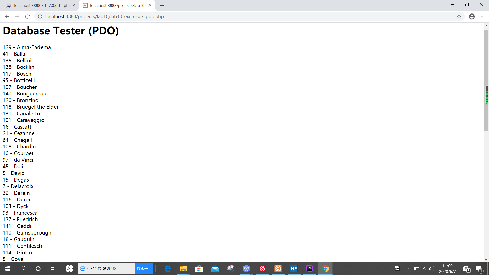
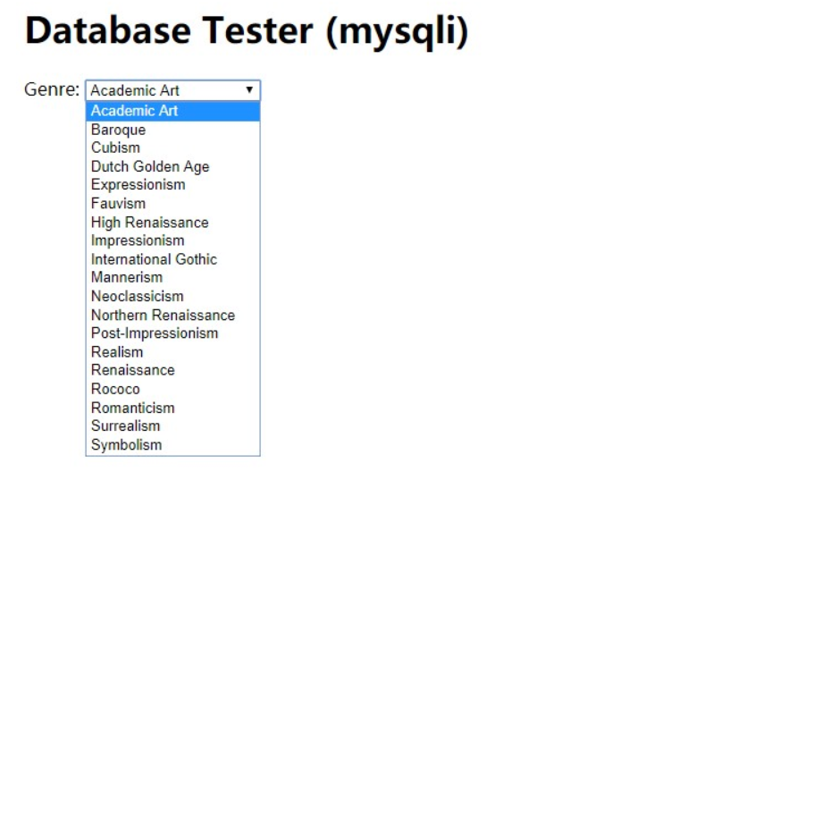
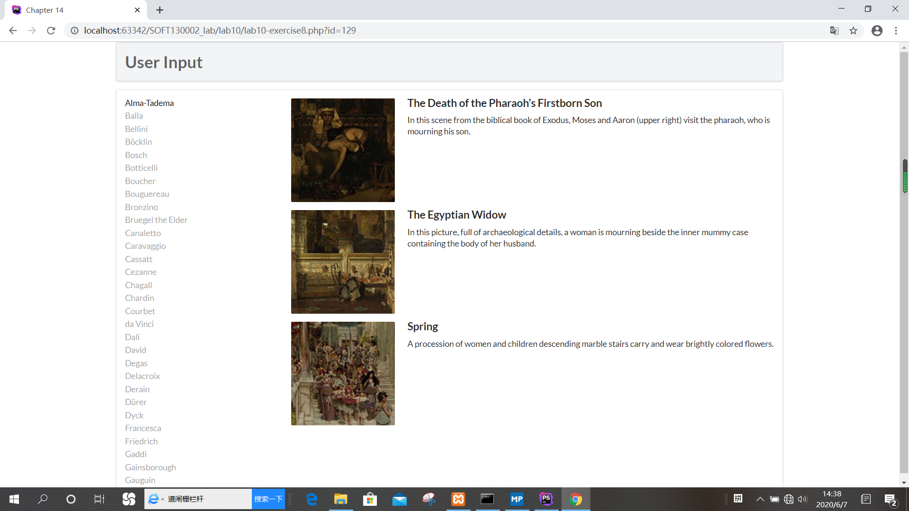
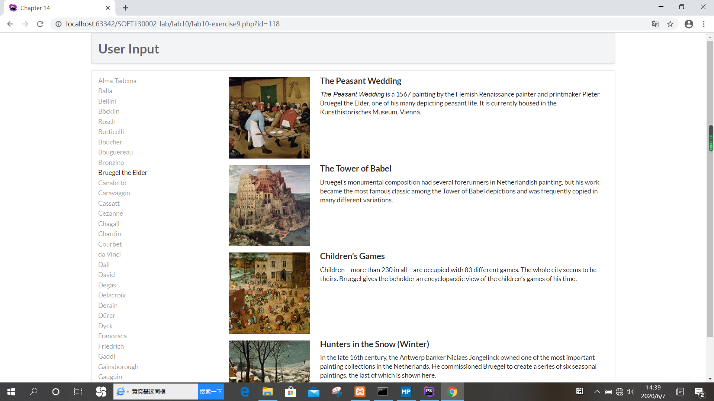

# lab10文档
19302010084-程茜
## Exercise7   
- ##### POD访问数据库：
    - 首先通过<?php require_once('config.php'); ?>引入配置文件，使用try-catch处理可能出现的错误；
    - 通过$pdo = new PDO(DBCONNSTRING,DBUSER,DBPASS)创建一个POD实例，与数据库连接；$pdo->setAttribute(PDO::ATTR_ERRMODE, PDO::ERRMODE_EXCEPTION)设置处理异常的方式为抛出异常；
    - sql语句查找Artist中所有的行，并且按照LaseName排序，然后把得到的结果赋给变量result，再使用while语句读出result中每一行的内容；最后用 $pdo = null断开连接。
- ##### Myspli访问数据库：
    - 也是通过<?php require_once('config.php'); ?>  引入配置文件，再用mysql数据库自己的连接方法mysqli\_connect与数据库建立连接，然后判断是否连接成功；
    - sql语句查找Genres中所有的行，并且按照GenreName排序，然后在while循环中利用mysqli_fetch_assoc依次取得每行的结果，把每行的数据作为一个option，循环完将result清空，最后用mysqli_close断开连接。
- 截图如下：

## Exercise8
- outputArtists()函数：此函数用于输出艺术家的信息。使用try-catch处理可能出现的异常，使用POD方式与数据库建立连接，sql语句查找Artist中所有的行，并且按照LaseName排序，并且设置行数范围为0~30，然后把结果赋给result。使用while循环，给每一行加上超链接，id为ArtiseID。if (isset($_GET['id']) && $_GET['id'] == $row['ArtistID']) echo 'active '是如果选择了艺术家，则添加一个active类；每个超链接的class初始化为“item”，超链接的显示内容是艺术家的lastname，最后断开连接。
- outputPaintings()函数：此函数用于输出艺术家的画作。首先判断是否选择了艺术家并且艺术家id不为空，如果是，那么以POD的方式与数据库建立连接，sql语句选出所有画作里与get发送的id一样的作品，利用while循环用outputSinglePainting($row)函数输出每一行的作品。
- outputSinglePainting()函数：主要是设置图片展示格式的语句。

## Exercise9
- 1.executeQuery 方法：用于产生单个结果集（ResultSet）的语句，例如 SELECT 语句。 被使用最多的执行 SQL 语句的方法。这个方法被用来执行 SELECT 语句，它几乎是使用最多的 SQL 语句。但也只能执行查询语句，执行后返回代表查询结果的ResultSet对象。
- 2.executeUpdate方法：用于执行 INSERT、UPDATE 或 DELETE 语句以及 SQL DDL（数据定义语言）语句，例如 CREATE TABLE 和 DROP TABLE。INSERT、UPDATE 或 DELETE 语句的效果是修改表中零行或多行中的一列或多列。executeUpdate 的返回值是一个整数（int），指示受影响的行数（即更新计数）。对于 CREATE TABLE 或 DROP TABLE 等不操作行的语句，executeUpdate 的返回值总为零。
- 3.execute方法：可用于执行任何SQL语句，返回一个boolean值，表明执行该SQL语句是否返回了ResultSet。如果执行后第一个结果是ResultSet，则返回true，否则返回false。
- 使用Prepared Statement的优点：
   - 代码的可读性和可维护性更好。
   - PreparedStatement尽最大可能提高性能。PreparedStatement有预编译，在多次执行同一个SQl语句时都只解析编译一次，可以极大地减少资源开销。
   - 极大地提高了安全性。传递给PreparedStatement对象的参数可以被强制进行类型转换，使开发人员可以确保在插入或查询数据时与底层的数据库格式匹配。
   - 不同的查询参数值，PreparedStatement可以重用。 
