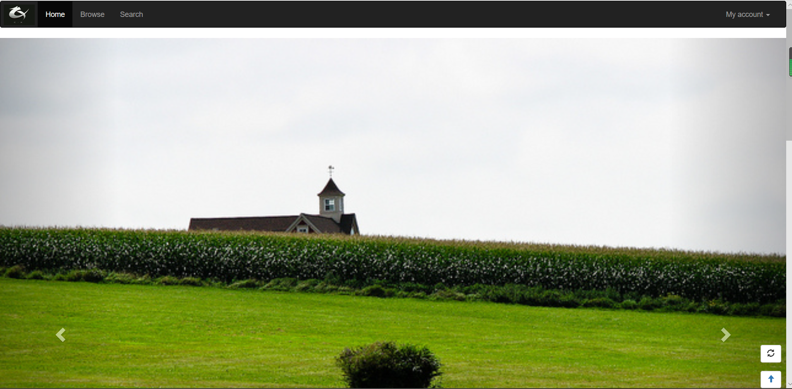
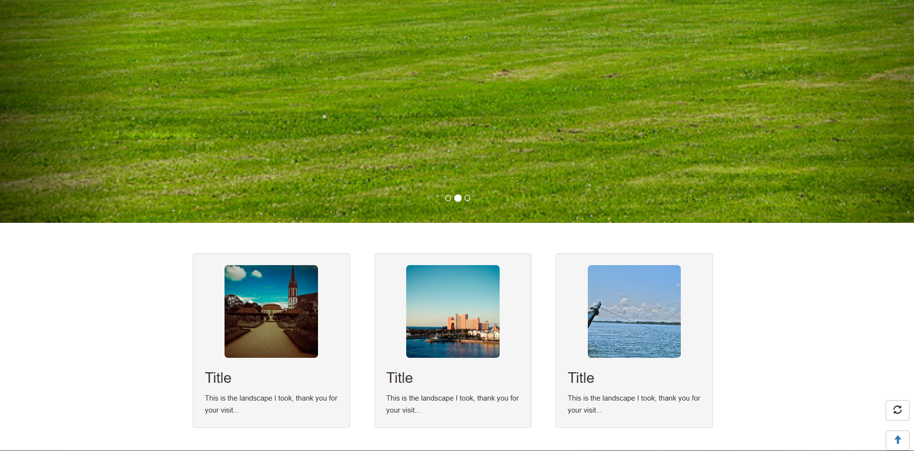

Lab4 设计文档
==========
-------------------
## 导航栏
导航栏采用的是bootstrap的**默认的导航条样式**，用.navbar-inverse将导航栏的背景颜色设置为黑色。

导航条最左边是“品牌图标”，放在一个div中，采用**container-fluid**和**navbar-header**类，并在img中设置图片的宽和高。

Home、Browser、Search和My account条目，放在一个**collapse**样式的div中，前三者放在一个无序列表中，并分别利用a元素加上链接。
“My account”放在左右边，采用bootstrap的**下拉菜单**样式。

## 头图
头图部分采用了bootstrap的**轮播**的样式，添加了三张大图，将每张图的宽度设置为100%，高度设置为auto。

## 图片展示
图片展示部分采用了bootstrap的**栅格系统**，每一行在一个为row类的div中，每张图片以及它的描述内容都采用了**well**样式。每张图片都用了**圆角**（img-rounded）、**响应式**img-responsive和**居中**（center-block）的布局。

## 页脚
页脚部分也采用了bootstrap的**栅格系统**样式，在index.css中设置页脚部分背景颜色为黑色，文字颜色为白色。

## 辅助图标
辅助图标用了bootstrap的**Glyphicons 字体图标**，在index.css中让辅助图标始终位于页面右下角。

## 作业效果图
如下：

