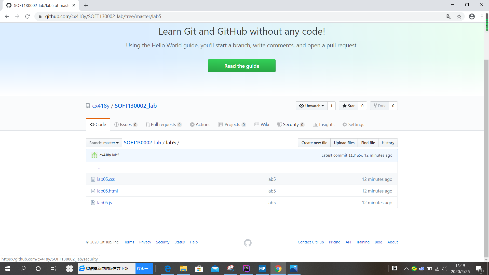

# Lab5设计文档
19302010084-程茜
## 函数相关知识点
1. 字符数组处理相关函数
2. 与设置时间相关的函数
3. 对象&数组
## 解决方案
1. 利用**indexOf()**获取url字符串中“name”和“&”所在的位置，再判断二者是否存在，分情况用**substring()**获取子字符串。
2. 用**setInterval()**设置每5秒运行一次函数timeTest，函数timeTest内容是让输入框里的值翻倍，到某一整分钟或运行十次以后，利用**clearInterval()**停止计时。
3. 定义一个对象数组obj，遍历输入框内字符串的每一个字符，把里面出现了的字母作为obj这个对象的key，然后循环的时候判断obj里面有没有以str[i]为key的对象，如有，就把它的value加一，说明这个字母在obj中出现的次数多了一次。再获取对象中所有key的值返回数组，获取所有value返回数组，用**Math.max**可以找出传入参数的最大值，再通过该值找到参数最大值对应的字符并输出。
## 网页效果截图

## GitHub截图

