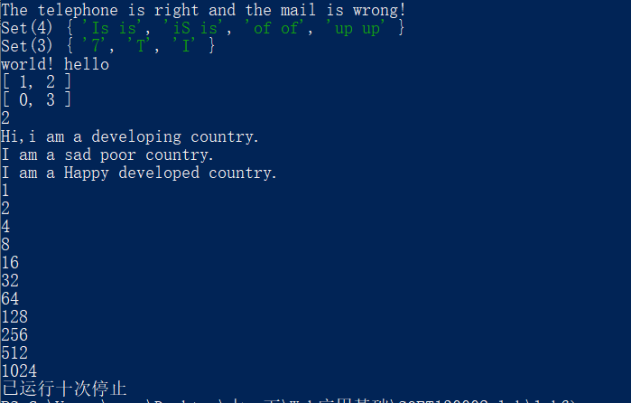

# lab6设计文档
19302010084-程茜
## 一、各个正则表达式的解释
### 1. 电话号码：  
   正则表达式： **“/^1\d{10}$/”**，   
   说明：使用“^“匹配号码的开始部分，用“$”匹配号码的结束部分以保证手机号码前后没有其他字符，“1”表示以1开头，“\d”表示所有ASCII数字，“{10}”表示匹配前一项“\d”十次。
### 2. 邮箱:        
   正则表达式：**“/^[a-zA-Z0-9]{1}([a-zA-Z0-9-\_])+@([a-zA-Z0-9-\_])+\.([a-zA-Z0-9-\_]+$)/”**   
   说明：使用“^”匹配邮箱的开始部分，用“$”匹配邮箱的结束部分以保证邮箱前后没有其他字符； 
   
   邮箱名称部分：**“[a-zA-Z0-9]”**表示邮箱应该以英文大小写字母或数字开头，“([a-zA-Z0-9-\_])”表示邮箱名称可以有英文大小写字母、数字、下划线\_、短横线-，括号代表捕获，+表示前面括号里面的内容出现1次或多次； 
 
   邮箱域名：@后面邮箱的域名应该为xx.xx的形式，故与邮箱名称一样用两次“([a-zA-Z0-9-\_])+”，在他们中间加上“.”。

### 3. 重复单词   
   正则表达式：**/(\b[a-z]+\b) \1/i  **    
   说明：js中是将前后两个英文单词连成一个字符串进行匹配的；正则表达式中“\b”用来匹配单词的边界，“[a-z]+”表示匹配小写字母1次或多次，“\1”表示再匹配一次前面括号中的内容。“i”表示不区分大小写匹配。

## 二、对继承不同方式的理解
### 1. 借助构造函数：   
   基本思想是在子类构造函数内部调用父类构造函数，本质是在子类实例中创建了父类属性，并且应在子类构造函数一开始调用父类构造函数，必须使用call的调用方式，否则容易造成无限循环。  
   问题：浪费问题：父类实例方法无法被复用。   
   原型问题：父类原型中的属性和方法对子类不可见，因此无法同时使用构造和原型。
### 2. 原型链继承：
   本质是将子类的原型设为父类的实例，某种意义上前面讲的实例和原型就是一次继承关系，而这里的父类和子类是多次继承关系。   
   问题：父类中的实例属性会成为子类的原型属性（尤其是父类实例属性属于引用类型的时候），无法在不影响所有子类实例情况下向父类构造函数传参。
### 3. Object.create原型式继承：
   是基于已有对象创建新对象，本质上是做了已有对象的浅复制（即不会重新创建引用类型的新实例；  
   问题：因为是浅复制，所以初始对象中的引用类型属性会被所有副本共享；

## 三、Map、Set、Array之间的区别和使用
### 1. Array：
   数组对象，是使用单独的变量名来存储一系列的值。所有数组都是Array类型实例。可以使用new关键字方式创建数组。   
   使用：Array类型提供了丰富的数组操作方法，如join方法（把数组串成字符串）、split方法（把字符串分割为数组）、reverse方法（数组倒置）等
### 2. Map：
   类似于对象的键值对有序列表，但其键可以是任意类型的，具有极快的查找速度。可以用new关键字创建，其size属性提供了成员个数。  
   使用：主要包含两类方法，操作方法和遍历方法。
### 3. Set：
   类似于数组的有序列表，但成员值都是唯一的。Set和Map类似，但set只存储key，且key不重复。可以使用new关键字创建，其size属性提供了成员个数。   
   使用：主要包含两类方法，操作方法和遍历方法。
## 四、截图
运行截图：

GitHub上传截图：

